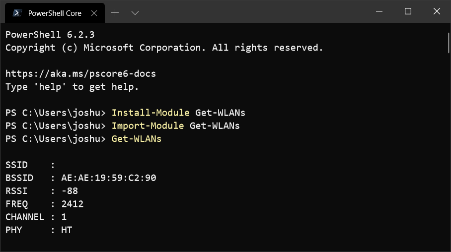
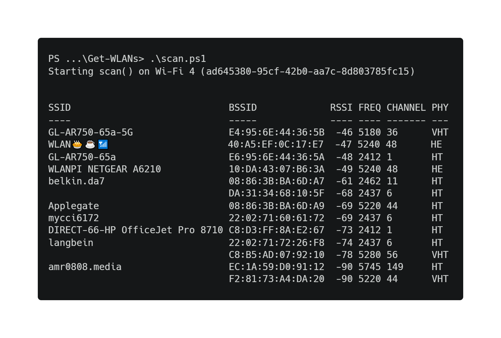

# Get-WLANs

This module is only for Windows devices and leverages Microsoft's Native Wifi [wlanapi.h](https://docs.microsoft.com/en-us/windows/win32/api/wlanapi/) to get information about nearby Wi-Fi networks. 

# Install from PowerShell Gallery

You can install [Get-WLANs from the PowerShell Gallery](https://www.powershellgallery.com/packages/Get-WLANs) (PSGallery). 

```
Install-Module -Name Get-WLANs
Import-Module Get-WLANs
Get-WLANs
```



# Basic Module Example

You can sort and format the output of `Get-WLANs` like this:

```
# assuming module was installed from PSGallery.
Import-Module Get-WLANs

# run scan, sort by RSSI, and display as a Format-Table
Get-WLANs | Sort-Object -Property RSSI -Descending | Format-Table

# remove module after we're done with it
Remove-Module Get-WLANs
```



# Updating

```
# update module with
Update-Module Get-WLANs

# get current version with
Get-Module Get-WLANs
```

# Known Issues

I've documented a few [known issues here](KNOWN_ISSUES.md)

# License

Project [license can be found here](LICENSE)
