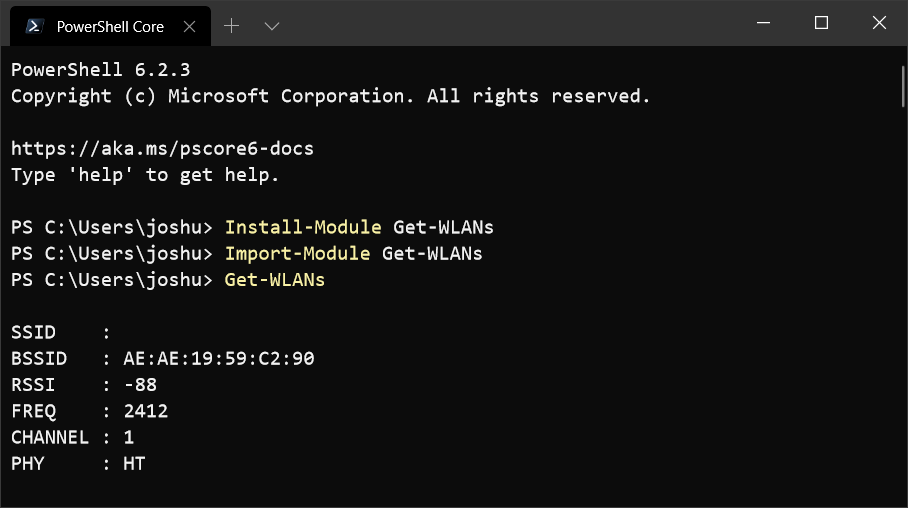
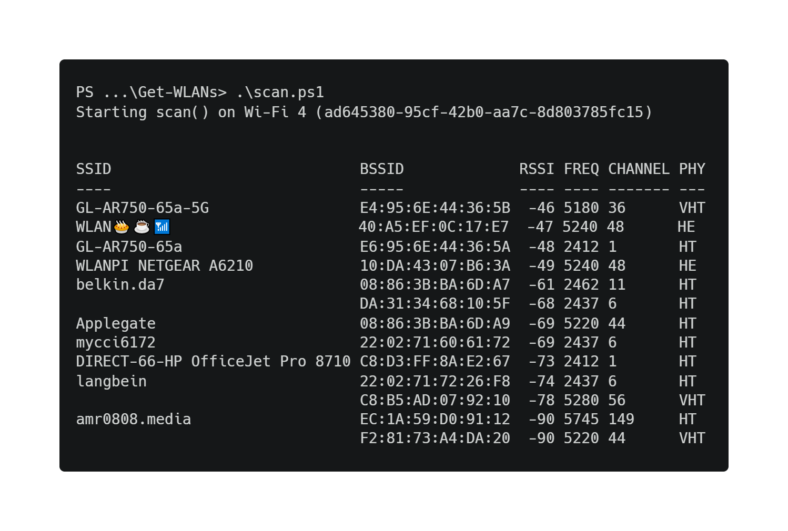

# Get-WLANs

A PowerShell module for Windows that retrieves detailed information about nearby Wi-Fi networks, with a focus on signal strength metrics. 

## Overview

This module leverages Windows' Native Wifi [wlanapi.h](https://docs.microsoft.com/en-us/windows/win32/api/wlanapi/) to provide information about nearby wireless networks, particularly RSSI (Received Signal Strength Indicator) values that aren't accessible through standard `netsh` commands.

## Requirements

- Host running Windows operating system
- Wireless NIC installed on the host
- PowerShell 3.0 or higher

## Use Cases

- Network diagnostics and troubleshooting
- Signal strength monitoring

## Install from PowerShell Gallery

You can install [Get-WLANs from the PowerShell Gallery](https://www.powershellgallery.com/packages/Get-WLANs) (PSGallery). 

```
Install-Module -Name Get-WLANs
Import-Module Get-WLANs
Get-WLANs
```



## Basic module example

You can sort and format the output of `Get-WLANs` like this:

```
# assuming module was installed from PSGallery.
Import-Module Get-WLANs

# run scan, sort by RSSI, and display as a Format-Table
Get-WLANs | Sort-Object -Property RSSI -Descending | Format-Table

# remove module after we're done with it
Remove-Module Get-WLANs
```



## Updating

```
# if the module is in use
Remove-Module Get-WLANs

# update module with
Update-Module Get-WLANs

# get current version with
Import-Module Get-WLANs
Get-Module Get-WLANs
```

## Known issues

I've documented a few [known issues here](KNOWN_ISSUES.md)

## License

Project [license can be found here](LICENSE)
